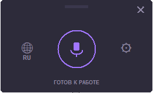

---

# 🎙️ Voice Typer

---

## 🌍 English Description

**Voice Typer** is a lightweight, local, and private voice-to-text typing assistant for Windows. Powered by OpenAI's Whisper, it records your voice via a global hotkey, transcribes it completely offline, and automatically pastes the text into any active text field using system emulation.

### ✨ Features

* **Push-to-Talk (Hold to Record):** Hold `F9` to speak, release to automatically type.
* **Global Hotkeys:** Works system-wide, even when minimized to the tray.
* **Language Switcher:** Toggle between Russian and English natively using `F10` or the UI globe button.
* **Toggle Visibility:** Press `F8` to quickly show or hide the application window.
* **Scalable UI:** Three screen resolutions available (`260x160`, `320x200`, `480x240`) that persist across restarts.
* **Privacy First:** No cloud APIs. All audio processing and recognition run locally on your machine.

---

## 🇷🇺 Описание проекта

**Voice Typer** — легковесный, полностью локальный и приватный ассистент голосового ввода для Windows. Работает на базе нейросети OpenAI Whisper: записывает речь по удержанию горячей клавиши, распознаёт её без отправки в интернет и автоматически вставляет готовый текст в любое активное поле ввода.



### ✨ Возможности

* **Режим Push-to-Talk:** Удерживайте `F9` для записи, отпустите — и программа сама напечатает текст.
* **Глобальные хоткеи:** Управление работает в любом приложении, даже когда окно свернуто в трей.
* **Быстрая смена языка:** Переключение между RU и EN в один клик по глобусу или по нажатию клавиши `F10`.
* **Быстрое скрытие:** Нажмите `F8`, чтобы мгновенно показать или спрятать окно.
* **Кастомные масштабы:** Поддержка трёх разрешений интерфейса (`260x160`, `320x200`, `480x240`) с сохранением настроек после перезапуска.
* **Абсолютная приватность:** Никаких облачных API. Обработка звука происходит исключительно на вашем ПК.

---

## 🛠️ Installation & Setup / Установка и настройка

### Prerequisites / Системные требования

1. **Python 3.10 / 3.11**
2. **FFmpeg:**
* **EN:** Required for audio decoding. Download FFmpeg for Windows and add its `/bin` folder to your system Environment Variables (`PATH`).
* **RU:** Необходим для декодирования аудио. Скачайте FFmpeg для Windows и добавьте путь к его папке `/bin` в системные переменные окружения (`PATH`).


### Step-by-Step Instructions / Пошаговая инструкция

Выполните следующие команды в терминале (`cmd` или `PowerShell`):

```cmd
:: 1. Navigate to your project directory / Перейдите в директорию проекта
cd /d d:\WorkHome\voice_typer

:: 2. Create a clean virtual environment / Создайте чистое виртуальное окружение
python -m venv venv

:: 3. Activate the virtual environment / Активируйте окружение
venv\Scripts\activate

:: 4. Upgrade pip & Install correct dependencies / Обновите pip и установите зависимости
pip install --upgrade pip
pip install numpy sounddevice pynput torch openai-whisper pyautogui pyperclip pillow pystray

```

---

## 🚀 Usage / Запуск и использование

Для запуска приложения используйте команду из активированного виртуального окружения (`venv`):

```cmd
python voice_typer.py

или

run_voice_typer.cmd

```

Если при запуске приложения ошибки или просто не запускается - используйте команду из активированного виртуального окружения (`venv`):

```cmd
debug_voice_typer.cmd
```

> 💡 **First Run Note / Важно при первом старте:**
> On your very first recording, Whisper will automatically download the chosen model weights (default size is `base`, ~140MB) to your local drive. This happens only once, subsequent recognition processes start instantly.
> При самой первой попытке надиктовать текст нейросеть начнет скачивание языковой модели (по умолчанию `base`, около 140 МБ). Это произойдет один раз, затем распознавание будет начинаться мгновенно.

### ⌨️ Hotkeys / Горячие клавиши по умолчанию

| Hotkey / Клавиша | Action (English) | Действие (Русский) |
| --- | --- | --- |
| **`F9` (Hold / Удержание)** | Start recording. Release to process and paste text. | Запись голоса. Отпустите для обработки и вставки текста. |
| **`F10`** | Toggle language globally (RU / EN). | Переключение языка распознавания (RU / EN). |
| **`F8`** | Show / Hide main interface window. | Показать или скрыть окно программы. |

---

## ⚙️ Configuration / Конфигурация

The application saves your preferences into a configuration file automatically created at:
Все пользовательские настройки и выбранный размер окна сохраняются в файле:

```text
%USERPROFILE%\.config\voice-typer\config.json

```

### Advanced Tweak / Ручная настройка:

* **EN:** You can manually edit this file to adjust the Whisper model size (`tiny`, `base`, `small`, `medium`), change sound channels, or bind custom hotkeys.
* **RU:** Вы можете отредактировать этот файл вручную, чтобы изменить конфигурацию горячих клавиш, параметры аудиокарты или переключить используемую модель Whisper (например, на `tiny` для экономии ресурсов или `small` для повышенной точности).

---

## 📄 License / Лицензия

This project is licensed under the MIT License.
Проект распространяется под лицензией MIT.